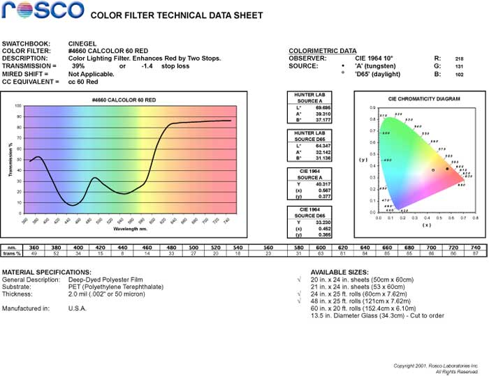

# rosco_filters_get_URLspider

## intro

get color filters datasheet from rosco.com, like



## usage

#### I'll provide the ID numbers

```
python main.py ID1.ID2.ID3.IDn --output_dir your-dir
```

#### Detect ID numbers from images

```
python rec_numbers.py your_img_path --output_dir your-dir
```

It'll automatically run main.py after detecting numbers.
