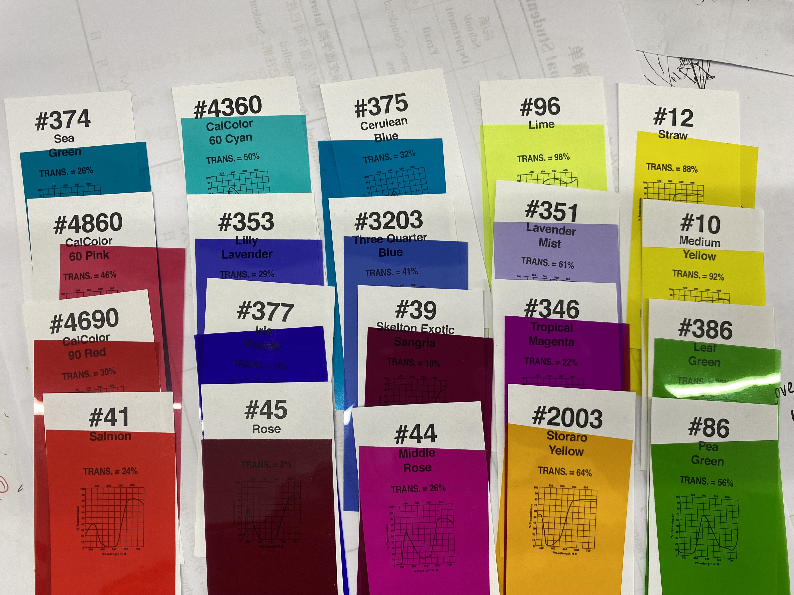

# rosco_filters_get_URLspider

## intro

get color filters datasheet from rosco.com, like


## usage

#### I can provide the ID numbers

```
python main.py ID1.ID2.ID3.IDn --output_dir your-dir
```

outputs are like:

```
====== deal with number 3203 ======
====== deal with number 4860 ======
====== deal with number 353 ======
====== deal with number 375 ======
--got 1 results
['https://cn.rosco.com/sites/default/files/content/filters//cinelux/375.jpg']
--downloading...
--got 1 results
['https://cn.rosco.com/sites/default/files/content/filters//cinegel/4860.jpg']
--downloading...
--got 0 results
[]
--downloading...
--  0 done in ./output\./375\./cinelux_375_jpg/cinelux_375.jpg
--  0 done in ./output\./4860\./cinegel_4860_jpg/cinegel_4860.jpg
--got 1 results
['https://cn.rosco.com/sites/default/files/content/filters//Permacolor/3203.pdf']
--downloading...
??????? this is strange, the out file Permacolor_3203_pdf already exists, pls check. Still save?(_/n)


--  0 done in ./output\./3203\./Permacolor_3203_pdf/Permacolor_3203.pdf
=== failed 1 numbers are ['353']
=== successed 3 numbers are ['375', '4860', '3203']
```

#### Detect ID numbers from images

```
python rec_numbers.py your_img_path --output_dir your-dir
```

It'll automatically run main.py after detecting numbers.

outputs are like:

```
=======found 20 results.
['374', '4360', '96', '12', '4860', '353', '3203', '351', '10', '377', '39', '346', '386', '41', '45', '2003', '44', '86', '375', '4690']
====== deal with number 374 ======
====== deal with number 4360 ======
====== deal with number 96 ======
====== deal with number 12 ======
====== deal with number 4860 ======
====== deal with number 353 ====== deal with number 3203 ======
======
====== deal with number 351 ====== deal with number 10 ============
======
 deal with number 377 ======
====== deal with number 39 ======
====== deal with number 346 ======
====== deal with number 386 ======
====== deal with number 41 ============ deal with number 45 ======

====== deal with number 2003======  deal with number 44 ============
====== deal with number 86 
======
====== deal with number 375 ======
====== deal with number 4690 ======
.
.
.
.
```

the input file of this example is shown in below


